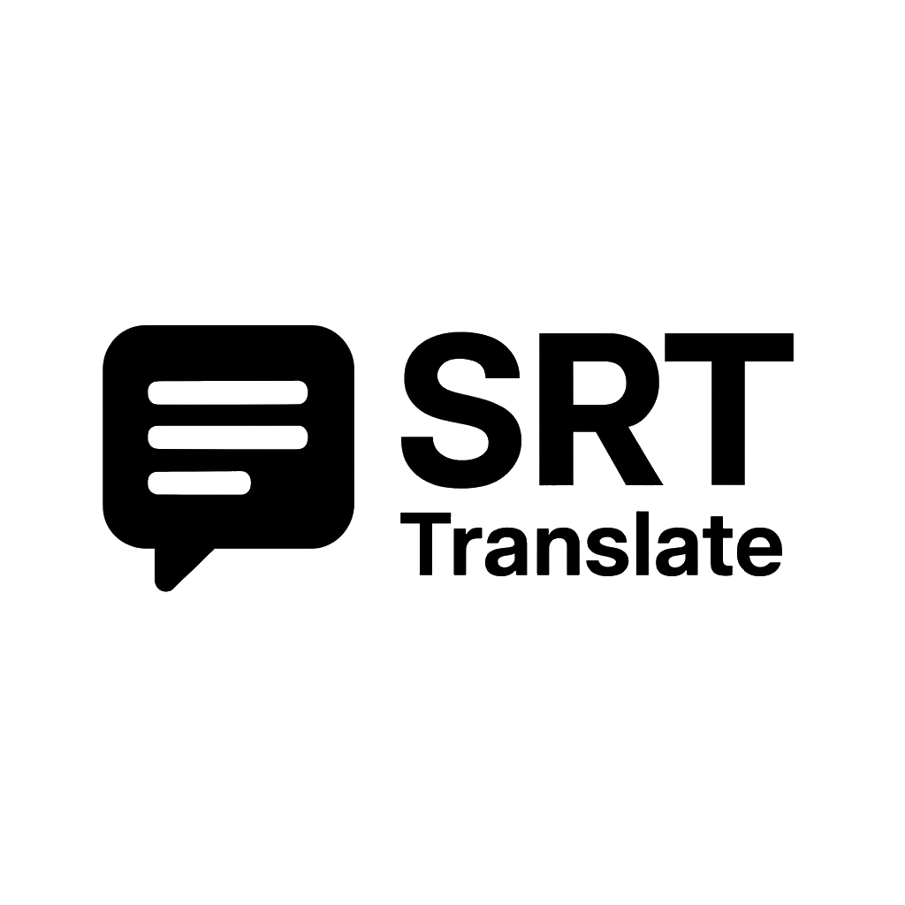

<div align="center">



### SRT Translate — Fast, reliable subtitle translation (.srt)

Upload an SRT file, pick a target language, download a clean, well‑formatted translation.

[](https://nextjs.org/) [](https://react.dev/) [](https://www.typescriptlang.org/) [](https://www.python.org/)

</div>

---

## What it does

SRT Translate helps you turn subtitle files (.srt) from one language to another while preserving timing, structure, and HTML tags like <i> and <b>. It uses a carefully tuned translation pipeline for high accuracy and consistent formatting.

### Highlights
- Keeps timecodes intact and preserves inline tags
- Groups related lines for better context and coherence
- Auto‑detects source language (or choose it manually)
- Produces a ready‑to‑use SRT file for direct import in your editor/player

## How to use

1) Upload your .srt file
2) Choose a target language (e.g., fr, en, es, de)
3) Optional: set source to auto (default)
4) Optional: enable grouped translation for extra context on longer scenes
5) Click Translate and download the resulting <filename>_<target>.srt

That’s it — no extra cleanup steps needed.

### Tips for best results
- Use well‑formed SRT files (each cue has a timecode line, then one or more text lines).
- Prefer UTF‑8 encoding; if you see garbled characters, re‑save your SRT as UTF‑8.
- Keep HTML/formatting tags simple (e.g., <i>, <b>); they’ll be retained in the output.

## FAQ

- Does it change timestamps?
  - No. Timecodes are preserved as in your original file.
- Will my formatting be kept?
  - Yes. Common inline tags like <i> and <b> are preserved.
- Can it handle RTL scripts (Arabic, Hebrew)?
  - Yes, right‑to‑left languages are supported.
- What’s the output encoding?
  - UTF‑8.
- I get “Invalid SRT”. What should I check?
  - Ensure each cue has a timecode line like `00:00:00,000 --> 00:00:01,234` followed by one or more text lines; remove stray blank lines within cues.

## Local usage

### 1) Full app (UI + backend)

```zsh
export PY_BACKEND_URL="http://127.0.0.1:8000"  # UI proxies to the local backend
npm install
pip3 install -r translate/requirements.txt
npm run dev:all                                # starts backend + UI
# open http://localhost:3000

# Stop backend later
npm run dev:stop
```

### 2) Backend only (with a file at repo root)

Place your SRT at the project root (e.g., ./movie.srt), then run:

```zsh
# start the backend API
python3 -m venv translate/.venv
source translate/.venv/bin/activate
pip install -r translate/requirements.txt
uvicorn translate.src.server.api:app --host 127.0.0.1 --port 8000 --reload
```

---

If this project helps you, a ⭐️ is appreciated. Feedback and contributions are welcome.